# Diagrama ER (Entity Relationship) da Base de Dados

Este documento contém o diagrama de entidade-relacionamento completo da base de dados do projeto.

## Diagrama Visual

```mermaid
erDiagram
    %% Core User Tables
    auth_users ||--o| profiles : "has"
    profiles ||--o| pos_clients : "syncs to"
    auth_users ||--o{ user_roles : "has"
    auth_users ||--o{ user_permissions : "has"
    
    %% Orders & Items
    auth_users ||--o{ orders : "places"
    orders ||--|{ order_items : "contains"
    products ||--o{ order_items : "referenced in"
    
    %% Reservations & Items
    auth_users ||--o{ reservations : "makes"
    reservations ||--|{ reservation_items : "contains"
    reservations ||--o{ reservation_history : "has"
    products ||--o{ reservation_items : "referenced in"
    
    %% Documents & Items
    pos_clients ||--o{ documents : "receives"
    documents ||--|{ document_items : "contains"
    document_series ||--o{ documents : "assigns number"
    documents ||--o{ document_email_history : "has"
    documents ||--o{ document_migration_logs : "has"
    documents ||--o{ efatura_logs : "has"
    products ||--o{ document_items : "referenced in"
    
    %% Financial
    pos_clients ||--o{ financial_transactions : "has"
    orders ||--o{ financial_transactions : "generates"
    reservations ||--o{ financial_transactions : "generates"
    
    %% Inventory
    products ||--o{ inventory_movements : "tracks"
    inventory_counts ||--|{ inventory_count_items : "contains"
    products ||--o{ inventory_count_items : "counted in"
    
    %% Reviews & Wishlist
    products ||--o{ product_reviews : "has"
    auth_users ||--o{ product_reviews : "writes"
    products ||--o{ wishlist : "added to"
    auth_users ||--o{ wishlist : "owns"
    
    %% Chat
    auth_users ||--o{ conversations : "participates"
    conversations ||--|{ chat_messages : "contains"
    
    %% Suppliers
    suppliers ||--o{ products : "supplies"
    
    %% Standalone Config Tables
    shipping_costs
    bank_accounts
    company_settings
    promotional_banners
    efatura_settings
    quick_replies

    %% Table Definitions
    profiles {
        uuid id PK
        text full_name
        text email
        text phone
        text default_address
        text default_island
        text nif
        text avatar_url
        boolean is_staff
    }
    
    user_roles {
        uuid id PK
        uuid user_id FK
        app_role role
    }
    
    user_permissions {
        uuid id PK
        uuid user_id FK
        system_module module
        module_permission[] permissions
    }
    
    products {
        text id PK
        text name
        text category
        numeric price
        integer stock
        text product_type
        text brand
        text supplier_id FK
        integer discount_percentage
    }
    
    orders {
        uuid id PK
        uuid user_id FK
        numeric total
        text status
        text delivery_method
        text shipping_island
        numeric shipping_cost
    }
    
    order_items {
        uuid id PK
        uuid order_id FK
        text product_id FK
        integer quantity
        numeric price
    }
    
    reservations {
        uuid id PK
        uuid user_id FK
        text product_id FK
        text payment_status
        text delivery_status
        numeric total_amount
        numeric initial_payment
    }
    
    reservation_items {
        uuid id PK
        uuid reservation_id FK
        text product_id FK
        integer quantity
        numeric price
    }
    
    documents {
        uuid id PK
        text document_number
        document_type document_type
        document_status status
        uuid client_id FK
        uuid series_id FK
        numeric total
        text efatura_status
    }
    
    document_items {
        uuid id PK
        uuid document_id FK
        text product_id FK
        text description
        numeric quantity
        numeric unit_price
    }
    
    document_series {
        uuid id PK
        text document_type
        text series_code
        integer current_number
        integer year
        boolean is_default
    }
    
    pos_clients {
        uuid id PK
        uuid user_id FK
        text full_name
        text email
        text nif
        text address
    }
    
    financial_transactions {
        uuid id PK
        uuid client_id FK
        uuid order_id FK
        uuid reservation_id FK
        numeric amount
        transaction_type transaction_type
        transaction_status status
        date due_date
    }
    
    inventory_movements {
        uuid id PK
        text product_id FK
        text movement_type
        numeric quantity
        numeric previous_stock
        numeric new_stock
    }
    
    inventory_counts {
        uuid id PK
        date count_date
        text status
    }
    
    inventory_count_items {
        uuid id PK
        uuid count_id FK
        text product_id FK
        numeric expected_quantity
        numeric counted_quantity
    }
    
    product_reviews {
        uuid id PK
        text product_id FK
        uuid user_id FK
        integer rating
        text title
        text comment
        text moderation_status
    }
    
    wishlist {
        uuid id PK
        uuid user_id FK
        text product_id FK
    }
    
    conversations {
        uuid id PK
        uuid client_id FK
        uuid admin_id FK
        text subject
        text status
    }
    
    chat_messages {
        uuid id PK
        uuid conversation_id FK
        uuid sender_id FK
        text message
        boolean is_read
    }
    
    suppliers {
        text id PK
        text name
        text email
        text nif
        text payment_terms
    }
    
    shipping_costs {
        uuid id PK
        text island
        numeric cost
        numeric free_shipping_threshold
    }
    
    bank_accounts {
        uuid id PK
        text bank_name
        text iban
        boolean is_default
    }
```

## Resumo das Relações

| Entidade Principal | Relações |
|-------------------|----------|
| **Users/Profiles** | orders, reservations, wishlist, reviews, conversations, user_roles |
| **Products** | order_items, reservation_items, document_items, reviews, wishlist, inventory |
| **Documents** | document_items, email_history, migration_logs, efatura_logs, series |
| **Orders** | order_items, financial_transactions |
| **Reservations** | reservation_items, history, financial_transactions |

## Tabelas por Módulo

### 🔐 Autenticação e Utilizadores
| Tabela | Descrição |
|--------|-----------|
| `profiles` | Perfis de utilizadores com dados pessoais |
| `user_roles` | Papéis/permissões dos utilizadores (admin, user) |
| `pos_clients` | Clientes do POS (sincronizado com profiles) |

### 🛒 E-commerce
| Tabela | Descrição |
|--------|-----------|
| `products` | Catálogo de produtos e serviços |
| `orders` | Encomendas dos clientes |
| `order_items` | Itens de cada encomenda |
| `reservations` | Reservas de produtos |
| `reservation_items` | Itens de cada reserva |
| `reservation_history` | Histórico de alterações nas reservas |
| `wishlist` | Lista de desejos dos utilizadores |
| `product_reviews` | Avaliações de produtos |

### 📄 Documentos e Faturação
| Tabela | Descrição |
|--------|-----------|
| `documents` | Faturas, proformas, orçamentos, etc. |
| `document_items` | Linhas de cada documento |
| `document_series` | Séries de numeração de documentos |
| `document_email_history` | Histórico de emails enviados |
| `document_migration_logs` | Logs de migração de documentos |
| `efatura_logs` | Logs de comunicação com e-Fatura |
| `efatura_settings` | Configurações de e-Fatura |

### 💰 Financeiro
| Tabela | Descrição |
|--------|-----------|
| `financial_transactions` | Transações financeiras (a receber/pagar) |
| `bank_accounts` | Contas bancárias da empresa |

### 📦 Inventário
| Tabela | Descrição |
|--------|-----------|
| `inventory_movements` | Movimentos de stock |
| `inventory_counts` | Contagens de inventário |
| `inventory_count_items` | Itens de cada contagem |
| `suppliers` | Fornecedores |

### 💬 Comunicação
| Tabela | Descrição |
|--------|-----------|
| `conversations` | Conversas de suporte |
| `chat_messages` | Mensagens de chat |
| `quick_replies` | Respostas rápidas pré-definidas |

### ⚙️ Configurações
| Tabela | Descrição |
|--------|-----------|
| `company_settings` | Configurações gerais da empresa |
| `shipping_costs` | Custos de envio por ilha |
| `promotional_banners` | Banners promocionais |

## Tipos Enumerados (ENUMs)

| Enum | Valores |
|------|---------|
| `app_role` | admin, user |
| `document_type` | invoice, proforma, proposal, receipt, credit_note, return_note, tve, transport_guide, simple_receipt, work_order, delivery_note, purchase_order |
| `document_status` | draft, pending, confirmed, cancelled, paid |
| `transaction_type` | receivable, payable |
| `transaction_status` | pending, partial, paid, overdue, cancelled |
| `recurrence_type` | none, weekly, monthly, quarterly, yearly |

## Storage Buckets

| Bucket | Público | Descrição |
|--------|---------|-----------|
| `product-images` | ✅ | Imagens de produtos |
| `avatars` | ✅ | Avatares de utilizadores |
| `company-assets` | ✅ | Assets da empresa (logo, etc.) |
| `payment-proofs` | ❌ | Comprovativos de pagamento |
| `chat-attachments` | ❌ | Anexos de chat |
| `service-attachments` | ❌ | Anexos de serviços |
| `efatura-certificates` | ❌ | Certificados e-Fatura |

---

*Última atualização: Janeiro 2026*
